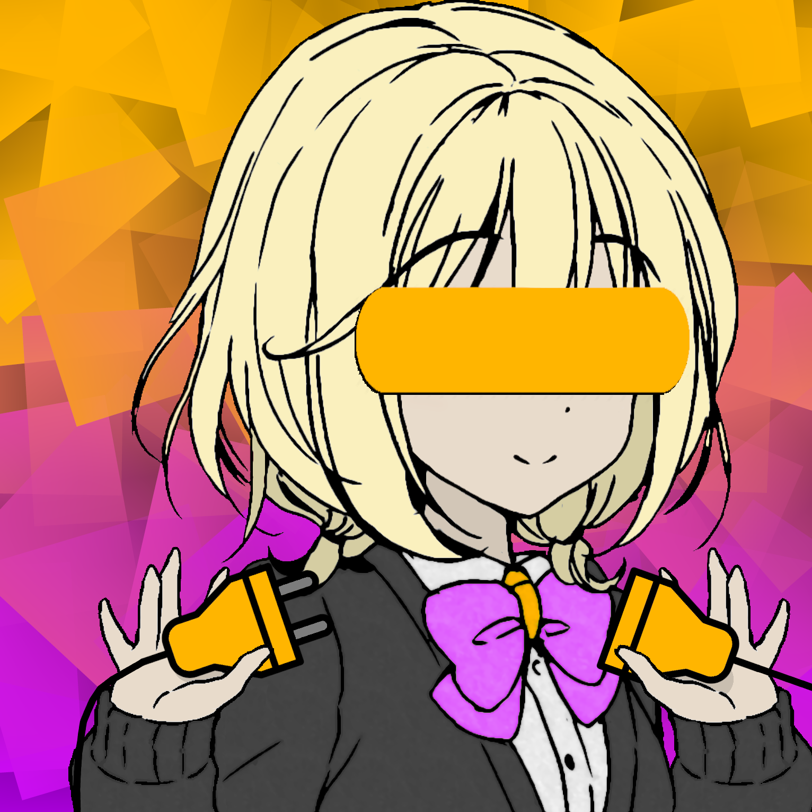

 <b> Plugin Base </b> 

 <b> Plugin Base releases </b> 

 <b> <a href="https://github.com/TheReal3rd/WurstMinus-Two-PluginBase/releases"> Releases </a> </b> 

 <b> <a href="https://github.com/TheReal3rd/WurstMinus-Public"> Public </a> </b> 

 <b> About: </b> 

 
Base project that can be used to start a new Plugin for ThirdMod(Wurst-2).

This project requires a copy of ThirdMod 4.3+ to be able to run the plugin.

Keep in mind Utils and other changes may occur to the main project, so update your plugin accordingly.

 <b> TODO: </b> 

 Fix mo bugs. 

 Fix Texture loading. 

 <b> Dev Info: </b> 

 Build gradlew attributes must be filled out correctly goto "build.gradle". 
